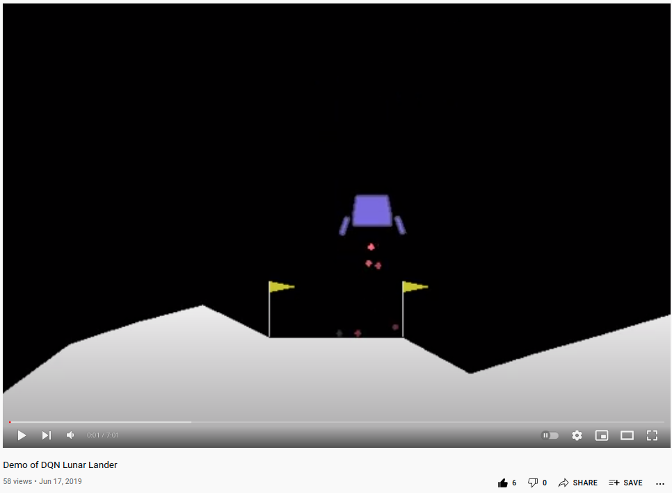

# CS7642_Project2
Project 2 of CS7642 Reinforcement Learning

**Double Deep Q Network to control Lunar Lander**

<a href="https://youtu.be/1JGJoPK00nw" target="_blank">
 
 <br>
 CLICK TO SEE THE VIDEO: Lunar Lander DDQN
</a>


To install this project, clone this repository first.

Then, create the Anaconda environment:
```
deactivate
conda env remove --name rl
conda create -n rl python=3.5 anaconda
conda activate rl
```

Install swig, pybox2d, gym, tensorflow, and keras:
```
conda install -c anaconda swig
conda install -c https://conda.anaconda.org/kne pybox2d
pip install gym
pip install tensorflow
pip install keras
```

Finally, you can execute the 2 Python scripts:

```
python lunar_lander_ddqn.py
```
This script trains the DDQN controller in the Lunar Lander environment with many combinations of metaparameters: alpha, gamma, number of hidden neurons, and number of neural layers. After each experiments, 2 files are generated: A log file in CSV format with the information about the experiment. And a neural network file in .h5 format which contains the weights of the neural network that successfully controls the Lunar Lander, only in case the controller is successful.

```
python expert_lunar_lander.py
```
This script executes the best Lunar Lander controller found so far which is stored in the file expertise.h5 (neural network file). This script executes a visual demo of 100 experiments and stores the results in the log file expertise.log.

**NOTE:** The log files are in CSV format which can be read by OfficeLibre's Calc in order to generate the graphs in the REPORT.pdf.
